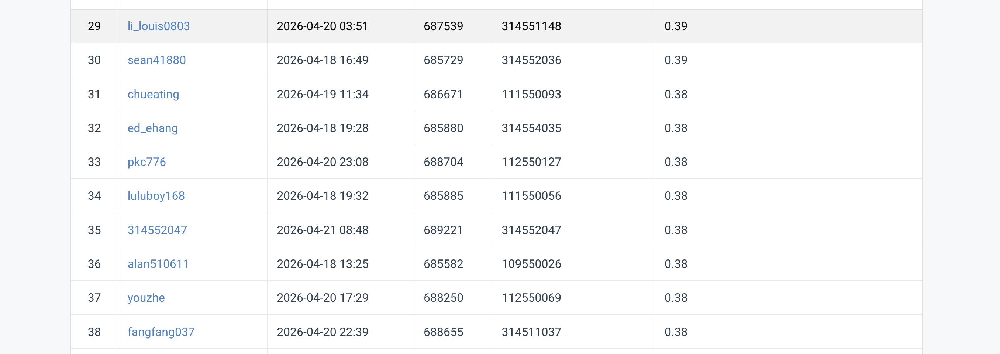

# NYCU Computer Vision 2026 HW2

- **Student ID:** 112550127
- **Name:** 江品寬 Pin-Kuan Chiang

## Introduction
This repository contains the source code for the Digit Detection task of NYCU VRDL Homework 2. We use a **Two-Stage Deformable DETR** architecture with a ResNet-50 backbone. In strict compliance with the assignment rules, only the backbone is initialized with ImageNet pre-trained weights; the entire Transformer encoder, decoder, and task-specific classification heads are trained completely from scratch in the `src/` package. 

To overcome the challenges of training from scratch on long aspect ratio digit strips without pre-trained spatial queries, we deploy test-time scaling interventions, aggressive bounding box threshold drop-offs to maximize COCO AUC Recall, and targeted data augmentation structures tailored strictly to semantics preservation (omitting random horizontal flips).

## Environment Setup
It is highly recommended to use a virtual environment via `conda`.

```bash
conda create -n hw2 python=3.10
conda activate hw2
pip install -r requirements.txt
# If timm is not installed, please run:
# pip install timm
```

## Usage

### Training
To train the model from scratch (requiring ~150 epochs to converge), run the following command. Note that `--two_stage` is essential to dynamically construct query features.

```bash
python -m src.train \
  --data_root nycu-hw2-data \
  --output_dir checkpoints_v2 \
  --epochs 150 \
  --batch_siz｀e 12 \
  --two_stage \
  --lr 2e-4 \
  --lr_backbone 2e-5
```

### Inference
To execute predictions across the test dataset optimally, use the tuned inference parameters:

```bash
python -m src.inference \
  --test_images nycu-hw2-data/test \
  --checkpoint checkpoints_v2/best_map.pth \
  --output_json pred.json \
  --batch_size 12 \
  --val_image_size 256 \
  --score_threshold 0.01 \
  --max_detections 300 \
  --two_stage
```

## Performance Snapshot
112550127 pkc776
