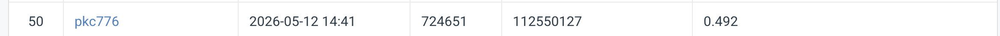

# NYCU Computer Vision 2026 HW3

- **Student ID:** 112550127
- **Name:** 江品寬 Pin-Kuan Chiang

## Introduction
This repository contains the source code for the Segmentation task of NYCU VRDL Homework 3. We use a **Cascade Mask R-CNN** architecture with a **ConvNeXt-V2-Base** backbone via Detectron2.

## Environment Setup
It is highly recommended to use a virtual environment via `conda`.

```bash
conda create -n hw3 python=3.10
conda activate hw3
pip install -r requirements.txt
```

## Usage

### Training
To train the model, run the following command:

```bash
python -m src.train 
```

### Inference
To execute predictions across the test dataset:

```bash
python -m src.inference 
```

## Performance Snapshot
112550127 pkc776

